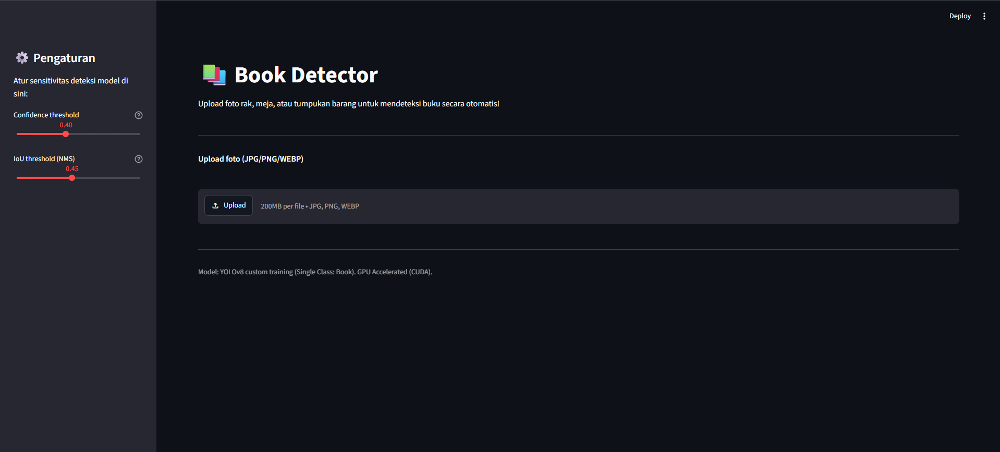

# 📚 Book Detector

Deteksi otomatis **buku** dari foto rak, meja, atau tumpukan barang menggunakan model kustom **YOLOv8** + **Streamlit**. Proyek ini mendemonstrasikan kapabilitas deteksi objek *single-class* dengan dukungan akselerasi GPU (CUDA) untuk performa *inference* secepat kilat.


## 📸 Preview

<!-- Ganti dengan screenshot hasil deteksi Streamlit kamu -->


## ✨ Fitur

- Upload foto secara langsung melalui antarmuka browser
- Deteksi kelas `book` secara akurat menggunakan model YOLOv8 hasil *custom training*
- Pengaturan *Confidence Threshold* dan *IoU Threshold* (NMS) interaktif melalui *sidebar*
- Ringkasan jumlah buku yang berhasil dideteksi secara otomatis
- Memanfaatkan GPU NVIDIA (CUDA) untuk pemrosesan gambar tanpa *lag*

## 🚀 Quickstart

```bash
git clone [https://github.com/rizqy-fadhil/book-detector.git](https://github.com/rizqy-fadhil/book-detector.git)
cd book-detector

# Sangat disarankan menggunakan Conda dengan Python 3.10
conda create -n yolo_env python=3.10 -y
conda activate yolo_env

pip install -r requirements.txt
python -m streamlit run app.py
```
Buka `http://localhost:8501` di browser, upload foto rak buku atau tumpukan buku, dan lihat hasilnya.

Catatan: Model yang digunakan adalah `best.pt` hasil training kustom yang tersimpan di dalam direktori runs/detect/train-2/weights/.

## 📁 Struktur Folder
```
book-detector/
├── app.py                   # Script antarmuka Streamlit
├── load_dataset.py          # Script untuk mengunduh dataset dari Roboflow
├── requirements.txt         # Daftar dependencies
└── runs/
    └── detect/
        └── train-2/
            └── weights/
                └── best.pt  # Model custom YOLOv8 (Book)
```
## 🧠 Cara Kerja
1. Model YOLOv8 dilatih (custom training) menggunakan dataset buku spesifik (diunduh via Roboflow) dengan dukungan PyTorch CUDA.
2. Parameter Confidence menentukan tingkat keyakinan minimum sebelum sebuah objek dianggap sebagai buku, sedangkan IoU mencegah munculnya kotak ganda (bounding box) pada satu buku yang sama.
3. Seluruh inferensi diproses menggunakan parameter device=0 untuk memastikan performa maksimal memanfaatkan GPU.

## 🔧 Roadmap / Pengembangan Lanjutan
- [ ] Ekstraksi teks dari buku yang terdeteksi menggunakan OCR (Optical Character Recognition)
- [ ] Fitur tracking untuk menghitung buku pada video atau tangkapan kamera (webcam) secara real-time
- [ ] Penambahan kelas deteksi baru (misal: membedakan buku tebal, buku tipis, atau majalah)

## 📄 Lisensi
MIT — bebas dipakai, dimodifikasi, dan disebarluaskan.
